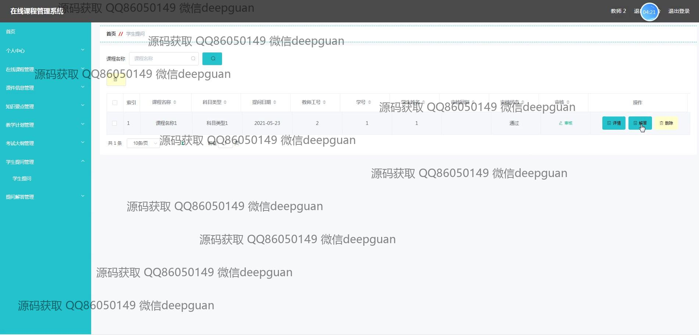
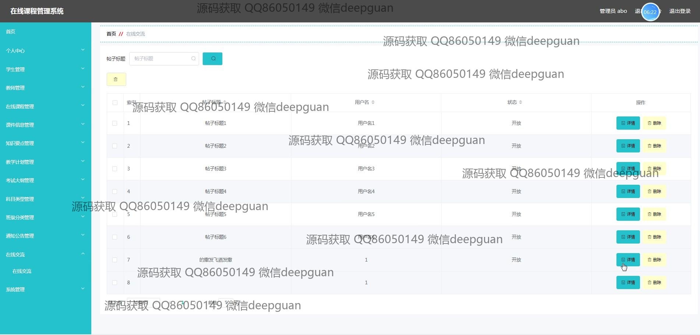

<h1 align="center">在线课程管理系统</h1>

## 简介
在线课程管理系统：角色分为管理员、学生、教师；功能包括课程管理、课件信息、在线交流、考试大纲、个人中心及校园资讯，为用户提供高效便捷的课程管理和学习体验。    --计算机毕业设计源码；毕设源码；java毕业设计源码

## 联系方式

<h3 align="center">获取完整代码与数据库文件 + 微信：deepguan QQ: 86050149 QQ群: 783742310</h3>

<h3 align="center">可帮忙远程部署 包运行成功！提供远程部署、修改代码、设计文档指导、代码讲解等服务！</h3>

## 功能介绍（完整见运行截图）
管理员：管理员可以通过登录界面选择角色并输入账号信息进行访问。他们拥有对系统各模块的全面管理权限，包括后台管理、课程信息管理、考试大纲管理、公告发布、用户注册和教师信息管理。管理员可以查询和维护系统中的教师和学生信息，以及进行课程信息的编辑和发布操作，是整个系统的管理核心力量。

教师：教师角色通过输入教师号和密码在系统中注册和登录，系统允许教师进行课程的创建、编辑和管理。他们可以查看所教课程，管理教学计划、知识点以及考试大纲；同时，教师可以使用在线交流论坛，与学生进行互动，回答学生的提问。教师角色在系统中负责编排课程内容，包括上传课件和视频，发布考试任务等教学活动。

学生：学生可以通过系统的登录界面输入账号信息并选择身份进行登录。学生用户能够浏览和注册在线课程，查看课程详情及进度，参与在线交流并提出问题。系统还为学生提供了管理个人信息的个人中心，学生可以查看考试成绩、课程反馈和与教师的互动记录，全面掌握学习情况。

用户：用户指在系统中进行注册和登录的所有角色，均可以通过个人中心管理个人信息。系统的设计旨在为用户提供一个简洁高效的教育管理平台，用户可以在导航菜单中方便地切换至所需模块，如课程信息查看、资源下载、教学计划管理等，提升在线学习和教学管理的效率。

## 运行截图

本代码来源于网络,仅供学习参考使用!

